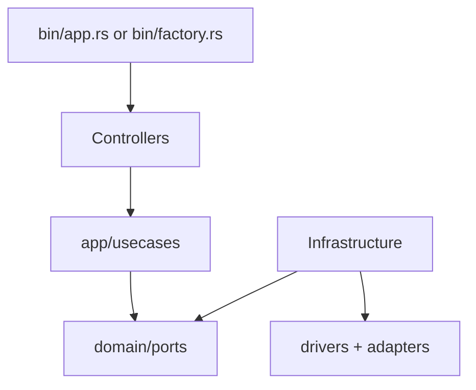

# ESP Light Development Guide

**Audience:** Contributors, AI Agents, and maintainers.

## Repository Rules

### Embedded Constraints

- This is a `#![no_std]` firmware. The standard library is not available.
- Heap allocations are limited (64 + 32 KB). Prefer stack allocation and `heapless` collections.
- Stack sizes matter: the HTTP server allocates ~8 KB of buffers on the stack. Ensure spawned tasks have sufficient stack.
- Use `embassy-time` for all timing; never block synchronously.

### Code Style

- Run `just format` and `just lint` before committing.
- Follow existing module structure and naming conventions.
- Keep layer boundaries clean (see [Architecture](#architecture) below).

### Feature Flags

| Flag  | Effect                                      |
|-------|---------------------------------------------|
| `log` | Enables runtime logging via `esp-println`   |

Use `--features log` (e.g., `just build-app-log`) during development for debug output.

## Commands (Justfile)

All commands require the ESP-IDF Rust environment. Most recipes source `$HOME/export-esp.sh` automatically.

### Building

| Command                | Description                                               |
|------------------------|-----------------------------------------------------------|
| `just build-app`       | Build main app firmware (debug)                           |
| `just build-app-log`   | Build main app with logging enabled                       |
| `just build-factory`   | Build factory firmware (release)                          |
| `just build-ota`       | Build release app and generate OTA `.bin` image           |

### Running / Flashing

| Command                | Description                                               |
|------------------------|-----------------------------------------------------------|
| `just run`             | Build and flash **factory** firmware, then monitor        |
| `just run-app`         | Build and flash **main app** firmware, then monitor       |
| `just run-app-log`     | Same as above with logging enabled                        |
| `just ota`             | Build OTA image and upload to device at `192.168.4.1`     |
| `just monitor`         | Open serial monitor (`espflash monitor`)                  |

### Development

| Command                    | Description                                           |
|----------------------------|-------------------------------------------------------|
| `just lint`                | Run `cargo clippy`                                    |
| `just lint-fix`            | Run clippy with `--fix --allow-dirty`                 |
| `just format`              | Run `cargo fmt`                                       |
| `just run-factory-page`    | Start Vite dev server for factory web UI (mock API)  |

## Architecture

The firmware follows a layered architecture inspired by Clean Architecture / Hexagonal patterns.

```
src/
├── bin/              # Entry points (factory.rs, app.rs)
├── controllers/      # Protocol handlers (HTTP, MQTT, button)
├── app/              # Use cases (business logic orchestration)
├── domain/           # Entities, DTOs, ports (trait definitions)
├── infrastructure/   # Concrete implementations
│   ├── adapters/     # External protocol adapters (MQTT client, HTTP server, button)
│   ├── drivers/      # Hardware drivers (LED, Wi-Fi, flash)
│   ├── services/     # Application services (light engine, persistence, firmware)
│   └── repositories/ # Data access (boot manager, persistent storage)
└── core/             # Shared primitives (HTTP parser, DHCP, sync utils)
```

### Dependency Flow



- **Controllers** receive external events (MQTT messages, HTTP requests, button presses) and translate them into use-case calls.
- **Use cases** orchestrate domain logic via **port traits** (defined in `domain/ports`).
- **Infrastructure** provides concrete implementations of ports using hardware drivers and external services.

### Factory Firmware Flow

1. Start Wi-Fi AP (`MyrtIO Светильник XXXX`) and DHCP server.
2. Serve web UI at `http://192.168.4.1/`.
3. Accept config via `POST /api/configuration` (Wi-Fi, MQTT, LED settings).
4. Accept OTA image via `POST /api/ota`, write to next partition, switch boot slot, reboot.

### Main App Flow

1. Read persisted config from flash.
2. If config is invalid (empty SSID or MQTT host), reboot into factory firmware.
3. Connect to Wi-Fi (STA mode) and MQTT broker.
4. Register Home Assistant light entity (discovery).
5. Handle commands via MQTT; persist state changes (debounced).
6. Boot button press triggers reboot into factory firmware.

## Flash Partitions

Defined in `partitions.csv`:

| Name         | Type | Offset     | Size    | Purpose                        |
|--------------|------|------------|---------|--------------------------------|
| nvs          | data | 0x9000     | 16 KB   | Non-volatile storage           |
| otadata      | data | 0xD000     | 8 KB    | OTA boot slot metadata         |
| phy_init     | data | 0xF000     | 4 KB    | PHY calibration                |
| factory      | app  | 0x10000    | 1 MB    | Factory firmware               |
| ota_0        | app  | 0x110000   | 1 MB    | Main app (OTA slot 0)          |
| ota_1        | app  | 0x210000   | 1 MB    | Main app (OTA slot 1)          |
| light_state  | data | 0x310000   | 64 KB   | Persistent light state + config|

## Key Constants

Defined in `src/config.rs`:

| Constant                 | Value              | Description                        |
|--------------------------|--------------------|------------------------------------|
| `LED_COUNT_MAX`          | 128                | Maximum supported LEDs             |
| `TEMPERATURE_MIN_KELVIN` | 1500               | Minimum color temperature          |
| `TEMPERATURE_MAX_KELVIN` | 6500               | Maximum color temperature          |
| `FACTORY_AP_IP_ADDRESS`  | 192.168.4.1        | Factory AP static IP               |
| `LIGHT_STATE_WRITE_DEBOUNCE` | 5000 ms        | Debounce before persisting state   |

## Extension Guidelines

### Adding a New Effect

1. Add the effect to `myrtio-light-composer` (see its `AGENTS.md`).
2. Update `supported_effects` array in `src/controllers/app/mqtt_homeassistant.rs`.

### Adding a New HTTP Endpoint (Factory)

1. Add a match arm in `FactoryHttpController::handle_request` (`src/controllers/factory/http.rs`).
2. Implement the handler function.
3. Use existing helpers (`conn.read_json`, `conn.write_json`, `conn.write_headers`).

### Adding a New Domain Port

1. Define the trait in `src/domain/ports/`.
2. Implement it in `src/infrastructure/services/` or `src/infrastructure/repositories/`.
3. Wire it up in the relevant `src/bin/*.rs` entry point.
